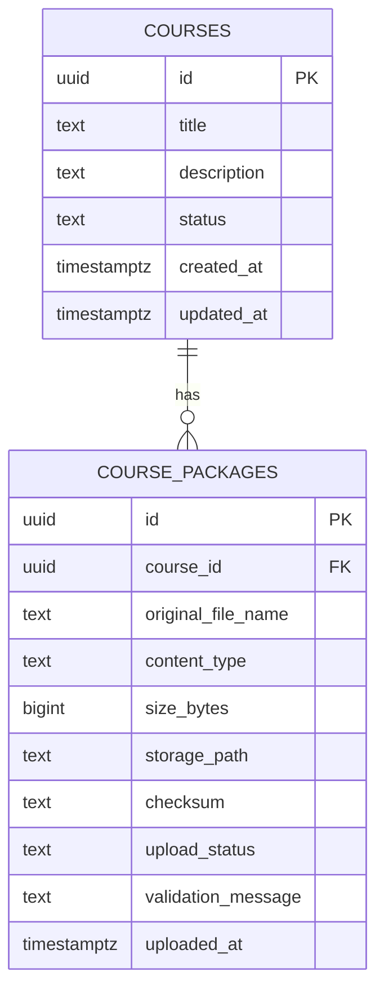

# Milestone 1 - Course Management Design

Milestone 1 is the "Hello Course" milestone from the roadmap. The goal is to upload and manage SCORM course packages.

## Success Criteria

- Upload a SCORM package.
- Store package metadata.
- View available courses.
- Delete uploaded courses.

This milestone does not need to extract packages, launch courses, play content, or persist learner progress. Those belong to later milestones.

## Backend Scope

Milestone 1 should add the first vertical slice for course package management:

- Domain model for uploaded courses and packages.
- Application use cases for upload, list, details, and delete.
- Infrastructure persistence with PostgreSQL.
- Infrastructure file storage for original uploaded packages.
- API endpoints under `/api/courses`.

## Database Schema

Milestone 1 needs two tables:

- `courses` stores the user-facing course record.
- `course_packages` stores upload-specific metadata for the source SCORM zip.

Keeping these separate allows later milestones to add package versions, extracted assets, launch metadata, and manifest details without overloading the course table.



### `courses`

| Column | Type | Required | Notes |
| --- | --- | --- | --- |
| `id` | `uuid` | Yes | Primary key generated by the application |
| `title` | `text` | Yes | Display title; initially derived from filename or manifest if available |
| `description` | `text` | No | Optional user-facing description |
| `status` | `text` | Yes | `uploaded`, `invalid`, or `deleted` for v1 |
| `created_at` | `timestamptz` | Yes | Creation timestamp |
| `updated_at` | `timestamptz` | Yes | Last update timestamp |

Recommended indexes:

- Primary key on `id`.
- Index on `status`.
- Index on `created_at`.

### `course_packages`

| Column | Type | Required | Notes |
| --- | --- | --- | --- |
| `id` | `uuid` | Yes | Primary key generated by the application |
| `course_id` | `uuid` | Yes | Foreign key to `courses.id` |
| `original_file_name` | `text` | Yes | Original uploaded filename |
| `content_type` | `text` | No | Browser-supplied content type |
| `size_bytes` | `bigint` | Yes | Uploaded file size |
| `storage_path` | `text` | Yes | Path or storage key for the uploaded zip |
| `checksum` | `text` | No | SHA-256 checksum for duplicate detection and integrity checks |
| `upload_status` | `text` | Yes | `accepted`, `rejected`, or `deleted` for v1 |
| `validation_message` | `text` | No | Reason an upload was rejected |
| `uploaded_at` | `timestamptz` | Yes | Upload timestamp |

Recommended indexes:

- Primary key on `id`.
- Foreign key index on `course_id`.
- Unique index on `checksum` can be considered later, but should not be required for Milestone 1.

## API Surface

### Upload Course

```http
POST /api/courses
Content-Type: multipart/form-data
```

Request form fields:

| Field | Required | Notes |
| --- | --- | --- |
| `package` | Yes | SCORM zip file |
| `title` | No | Optional display title override |
| `description` | No | Optional display description |

Response:

```json
{
  "id": "2f79c7de-1af6-49b8-96ef-f9efa6541146",
  "title": "Workplace Safety",
  "description": null,
  "status": "uploaded",
  "package": {
    "id": "627df831-33f7-48a2-9afe-51d056c50aae",
    "originalFileName": "workplace-safety.zip",
    "sizeBytes": 1048576,
    "checksum": "sha256-value",
    "uploadedAt": "2026-06-13T18:00:00Z"
  },
  "createdAt": "2026-06-13T18:00:00Z",
  "updatedAt": "2026-06-13T18:00:00Z"
}
```

Validation:

- File is required.
- File extension must be `.zip`.
- File size must be greater than zero.
- File size must not exceed the configured upload limit.
- Uploaded archive should contain an `imsmanifest.xml` file at the package root when practical to validate during Milestone 1.

Status codes:

| Status | Meaning |
| --- | --- |
| `201 Created` | Course package accepted |
| `400 Bad Request` | Missing file, invalid file type, invalid archive, or missing manifest |
| `413 Payload Too Large` | File exceeds configured limit |
| `500 Internal Server Error` | Unexpected upload or persistence failure |

### List Courses

```http
GET /api/courses
```

Optional query parameters:

| Parameter | Notes |
| --- | --- |
| `status` | Filter by course status |
| `page` | Defaults to `1` |
| `pageSize` | Defaults to `25` |

Response:

```json
{
  "items": [
    {
      "id": "2f79c7de-1af6-49b8-96ef-f9efa6541146",
      "title": "Workplace Safety",
      "description": null,
      "status": "uploaded",
      "packageFileName": "workplace-safety.zip",
      "packageSizeBytes": 1048576,
      "createdAt": "2026-06-13T18:00:00Z",
      "updatedAt": "2026-06-13T18:00:00Z"
    }
  ],
  "page": 1,
  "pageSize": 25,
  "totalCount": 1
}
```

Status codes:

| Status | Meaning |
| --- | --- |
| `200 OK` | Courses returned |

### Get Course Details

```http
GET /api/courses/{courseId}
```

Response should use the same shape as the upload response.

Status codes:

| Status | Meaning |
| --- | --- |
| `200 OK` | Course found |
| `404 Not Found` | Course does not exist or was deleted |

### Delete Course

```http
DELETE /api/courses/{courseId}
```

Deletion should remove or mark deleted:

- Course metadata.
- Course package metadata.
- Stored uploaded package file.

For Milestone 1, soft delete in the database is acceptable if it makes storage cleanup safer. The API should not return soft-deleted courses from list or detail endpoints.

Status codes:

| Status | Meaning |
| --- | --- |
| `204 No Content` | Course deleted |
| `404 Not Found` | Course does not exist or was already deleted |

## Clean Architecture Placement

### Domain

Suggested types:

- `Course`
- `CoursePackage`
- `CourseStatus`
- `CoursePackageStatus`

Domain rules:

- A course must have a title.
- A course can have one uploaded package for Milestone 1.
- Deleted courses should not be treated as available.

### Application

Suggested use cases:

- `UploadCoursePackage`
- `ListCourses`
- `GetCourseDetails`
- `DeleteCourse`

Suggested interfaces:

- `ICourseRepository`
- `ICoursePackageStorage`
- `ICoursePackageValidator`
- `IClock`

Application concerns:

- Validate request intent.
- Coordinate file storage and persistence.
- Return API-friendly result models.
- Avoid direct dependency on Entity Framework Core or filesystem APIs.

### Infrastructure

Suggested implementations:

- `OpenTrainingPlatformDbContext`
- `EfCourseRepository`
- `LocalCoursePackageStorage`
- `ZipCoursePackageValidator`

Infrastructure concerns:

- PostgreSQL mappings and migrations.
- Local storage path management.
- SHA-256 checksum generation.
- Basic zip and `imsmanifest.xml` validation.

### API

Suggested endpoint grouping:

- `CoursesEndpoints`
- `CourseUploadRequest`
- `CourseResponse`
- `CourseListResponse`

The API should stay thin: bind HTTP requests, call application use cases, and translate use case results into HTTP responses.

## Implementation Order

1. Add central package management with `backend/Directory.Packages.props` if it is not already present.
2. Add project references for `Api -> Application`, `Api -> Infrastructure`, `Application -> Domain`, and `Infrastructure -> Application`.
3. Add domain course/package models and statuses.
4. Add application use case contracts and result models.
5. Add PostgreSQL persistence and the first migration.
6. Add local package storage and upload validation.
7. Add `/api/courses` endpoints.
8. Add focused tests for validation, repository behavior, and endpoint responses.

## Deferred Until Later Milestones

- Package extraction.
- Launch URL resolution.
- SCORM runtime JavaScript API.
- Learner attempts.
- Completion tracking.
- Authentication.
