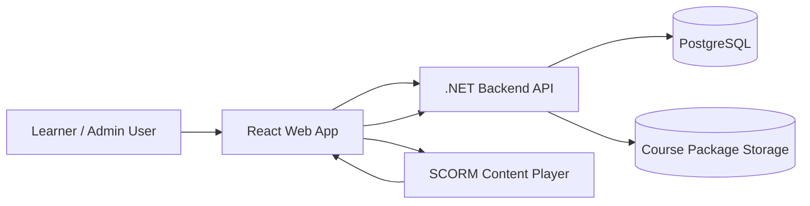
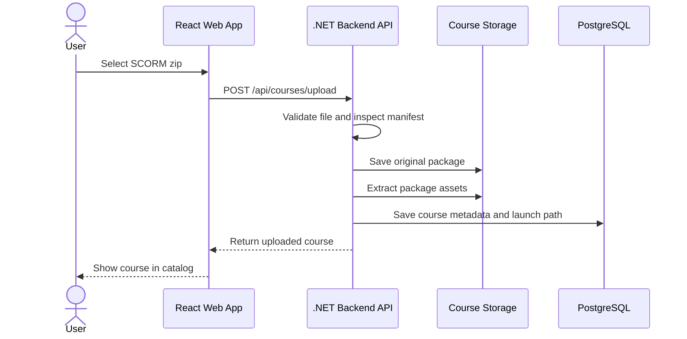
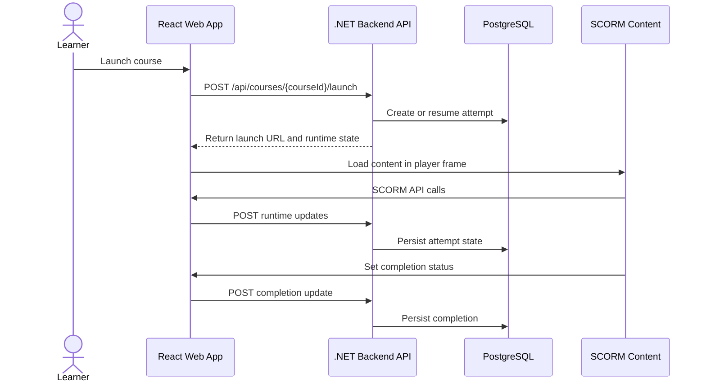
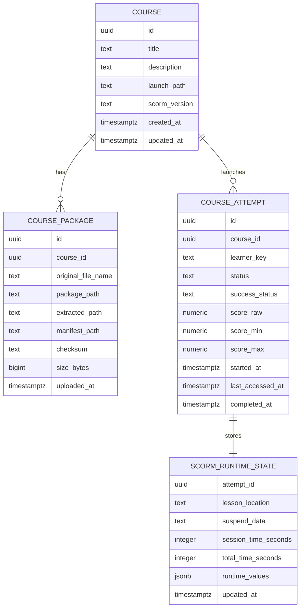

# Version 1 Architecture

## Purpose

Open Training Platform is an open-source training content platform focused on SCORM package management, course launch, course playback, and learner progress tracking.

Version 1 is successful when a user can:

1. Upload a SCORM package.
2. Launch a course.
3. Complete a course.
4. Persist completion status.

This document describes a practical starting architecture for the first version.

## Technology Stack

The initial implementation will use the following core technologies:

| Area | Technology | Role |
| --- | --- | --- |
| Backend | .NET | Backend API, SCORM package processing, course launch, and progress persistence |
| Database | PostgreSQL | Durable storage for course metadata, attempts, runtime state, and completion records |
| Frontend | TypeScript with React | Course catalog, upload experience, player shell, and SCORM runtime adapter |

Supporting backend libraries should be chosen to fit this stack, such as ASP.NET Core for HTTP APIs, Entity Framework Core with Npgsql for PostgreSQL access, and the standard .NET archive/XML APIs where they are sufficient for SCORM package inspection. Backend package versions should be managed centrally with `Directory.Packages.props`.

## Architecture Goals

- Keep the system simple enough to build incrementally.
- Separate course package storage from relational application data.
- Support SCORM runtime communication from launched course content.
- Make local development and future Docker deployment straightforward.
- Leave room for later authentication, xAPI, and public release work without designing all of it now.

## Non-Goals

Version 1 does not include:

- Full LMS functionality.
- Certifications or credentialing.
- Advanced reporting.
- Multi-tenancy.
- Billing or marketplace features.
- Enterprise-scale infrastructure.

## System Context



## High-Level Components

### React Web App

The frontend provides the user-facing experience for course administration and course playback.

Initial responsibilities:

- Upload SCORM zip packages.
- Display the course catalog.
- Delete uploaded courses.
- Launch a selected course.
- Host the course player shell.
- Bridge SCORM runtime calls from course content to the backend API.
- Display basic course completion history when available.

Recommended structure:

- `courses` feature for upload, list, details, and delete flows.
- `player` feature for course launch and SCORM runtime communication.
- Shared API client for backend calls.
- Minimal routing for catalog and player screens.

### .NET Backend API

The backend is the main application boundary for course management, launch metadata, and progress persistence.

Initial responsibilities:

- Accept SCORM package uploads.
- Validate uploaded package type and basic structure.
- Extract SCORM packages into a controlled storage location.
- Parse enough SCORM manifest metadata to identify launchable content.
- Store course metadata in PostgreSQL.
- Serve or authorize access to extracted course assets.
- Receive SCORM runtime updates from the frontend.
- Persist learner progress, suspend data, completion status, and score fields.

Recommended starting style:

- ASP.NET Core Web API.
- Entity Framework Core with Npgsql for PostgreSQL access.
- Clean architecture project boundaries for domain, application, and infrastructure code.
- Central package version management with `Directory.Packages.props`.
- Background jobs only when a feature genuinely requires them.

The intended backend dependency direction is:

```text
Api -> Application -> Domain
Api -> Infrastructure -> Application -> Domain
Infrastructure -> Domain
```

The `Domain` project should contain core business concepts and rules without depending on frameworks. The `Application` project should contain use cases, interfaces, validation, and orchestration. The `Infrastructure` project should contain PostgreSQL, file storage, manifest parsing implementation details, and external service integrations. The `Api` project should expose HTTP endpoints and wire the application together through dependency injection.

### PostgreSQL

PostgreSQL stores relational application data and learner state.

Initial data areas:

- Courses.
- Course package metadata.
- Launch entries.
- Learner course attempts.
- SCORM runtime state.
- Completion and success status.

PostgreSQL should not store large extracted course files directly. Store file paths, object keys, checksums, and metadata instead.

### Course Package Storage

Course packages and extracted assets should live outside the relational database.

Version 1 can start with local filesystem storage:

- Uploaded zip packages.
- Extracted course directories.
- Manifest files.
- Static launch assets.

The storage boundary should be wrapped behind a backend service so a later release can move to object storage without rewriting course management logic.

## Proposed Runtime Flow

### Course Upload



### Course Launch and Tracking



## Backend API Surface

The first API does not need to be large. A reasonable v1 surface is:

| Area | Endpoint | Purpose |
| --- | --- | --- |
| Courses | `GET /api/courses` | List uploaded courses |
| Courses | `POST /api/courses/upload` | Upload a SCORM package |
| Courses | `GET /api/courses/{courseId}` | Get course metadata |
| Courses | `DELETE /api/courses/{courseId}` | Delete a course and associated files |
| Launch | `POST /api/courses/{courseId}/launch` | Create or resume a learner attempt |
| Runtime | `GET /api/attempts/{attemptId}/runtime` | Load stored SCORM runtime state |
| Runtime | `POST /api/attempts/{attemptId}/runtime` | Save SCORM runtime state changes |
| Attempts | `GET /api/attempts` | List learner attempt history |

Authentication can be deferred at first by using a single local learner identity. When multi-user support arrives, these endpoints can become user-scoped.

## Initial Data Model



## Suggested Repository Shape

The repository is currently documentation-only. A simple implementation structure could be:

```text
backend/
  Directory.Packages.props
  OpenTrainingPlatform.sln
  api/
    OpenTrainingPlatform.Api.csproj
  shared/
    OpenTrainingPlatform.Domain/
      OpenTrainingPlatform.Domain.csproj
      Courses/
      Attempts/
      Scorm/
    OpenTrainingPlatform.Application/
      OpenTrainingPlatform.Application.csproj
      Courses/
      Attempts/
      Scorm/
      Storage/
    OpenTrainingPlatform.Infrastructure/
      OpenTrainingPlatform.Infrastructure.csproj
      Data/
      Storage/
      Scorm/
docs/
  V1_ARCHITECTURE.md
ui/
  src/
    app/
    features/
      courses/
      player/
    api/
    components/
    routes/
    styles/
  package.json
  tsconfig.json
```

This keeps the backend, documentation, and frontend clearly separated while allowing the project to remain easy to run locally.

The `backend/api` folder should contain the ASP.NET Core API project only. The `backend/shared` folder should contain the clean architecture projects used by the API:

- `OpenTrainingPlatform.Domain` for entities, value objects, domain rules, and domain-level constants.
- `OpenTrainingPlatform.Application` for use cases, service interfaces, commands, queries, validation, and application DTOs.
- `OpenTrainingPlatform.Infrastructure` for Entity Framework Core, PostgreSQL configuration, file storage, SCORM package extraction, manifest parsing, and implementations of application interfaces.

The backend should use `backend/Directory.Packages.props` for central package version management. Project files should reference packages without individual version numbers unless a package genuinely needs to opt out.

The `ui` folder can start with a conventional React application layout:

- `app` for application bootstrap, providers, and top-level routing setup.
- `features/courses` for course upload, course list, course details, and delete flows.
- `features/player` for launch, iframe/player shell, and SCORM runtime adapter code.
- `api` for typed backend API clients.
- `components` for reusable UI components that are not specific to a single feature.
- `routes` for route definitions if the router setup grows beyond the app bootstrap.
- `styles` for global CSS, theme tokens, or shared styling files.

The UI structure should stay feature-oriented. As a rule of thumb, code should begin inside a feature folder unless it is clearly reused across multiple features.

## SCORM Runtime Approach

SCORM content expects a JavaScript runtime API to exist in the browser window hierarchy. The React player should provide that runtime adapter and translate SCORM calls into backend persistence calls.

Version 1 should focus on a small, reliable SCORM data set:

- `cmi.core.lesson_status` or SCORM 2004 equivalent completion fields.
- `cmi.core.lesson_location`.
- `cmi.suspend_data`.
- `cmi.core.score.raw`, `min`, and `max`.
- Session and total time fields.

The adapter can initially batch or debounce runtime updates to reduce API calls, with an explicit save on unload or course exit.

## Local Development

Recommended local services:

- .NET backend API.
- PostgreSQL database.
- React development server.
- Local course storage directory.

Recommended configuration values:

- PostgreSQL connection string.
- Course package storage root.
- Allowed frontend origin.
- Maximum upload size.

Sensitive local configuration should stay out of source control. The existing `.gitignore` already excludes common local settings such as `.env`, `appsettings.Development.json`, and local secrets.

## Incremental Build Plan

1. Create the .NET API and PostgreSQL schema for course metadata.
2. Add SCORM zip upload with storage and manifest inspection.
3. Build the React course catalog and upload UI.
4. Add package extraction and static asset serving.
5. Build the player shell and launch endpoint.
6. Add the browser SCORM runtime adapter.
7. Persist runtime state and completion status.
8. Add focused tests around upload validation, manifest parsing, and runtime persistence.

## Open Decisions

- Whether backend tests live under `backend/tests`, a top-level `tests` folder, or beside each backend project.
- Whether extracted course assets are served directly by ASP.NET Core or by a static file server in deployment.
- Which SCORM versions are explicitly supported first.
- Whether v1 uses a single local learner identity or introduces basic authentication earlier.
- Whether uploaded packages are retained after extraction or can be discarded.

## Risks and Mitigations

| Risk | Mitigation |
| --- | --- |
| SCORM packages vary widely in structure | Start with common SCORM 1.2 packages, validate manifests, and add fixtures as bugs are found |
| Runtime data is lost on browser close | Debounce saves during playback and force a final save on exit/unload |
| Course assets create path traversal or unsafe file issues | Normalize extraction paths, reject unsafe archive entries, and serve only from controlled storage roots |
| Architecture becomes too heavy too early | Keep v1 feature-oriented and refactor only when blocked by real implementation friction |
| Database and file storage drift apart | Use explicit package records, checksums, and delete flows that handle both metadata and files |

## Version 1 Boundary

Version 1 should stop once a learner can upload, launch, complete, and persist completion for a SCORM course. Everything beyond that belongs in later milestones unless it directly blocks this flow.
